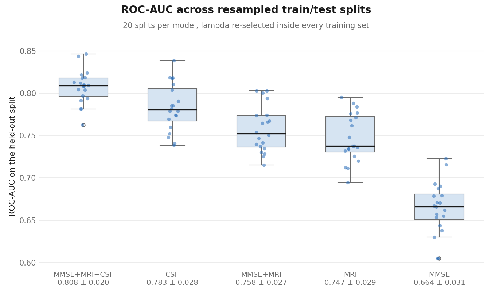
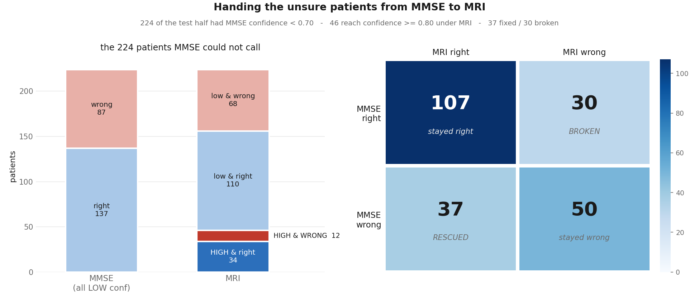
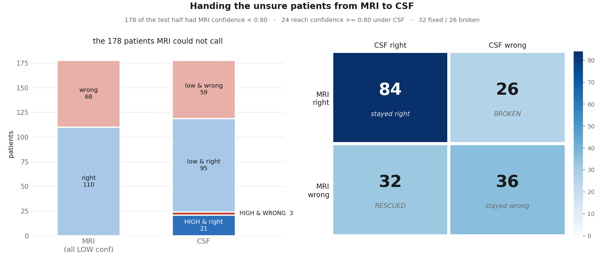
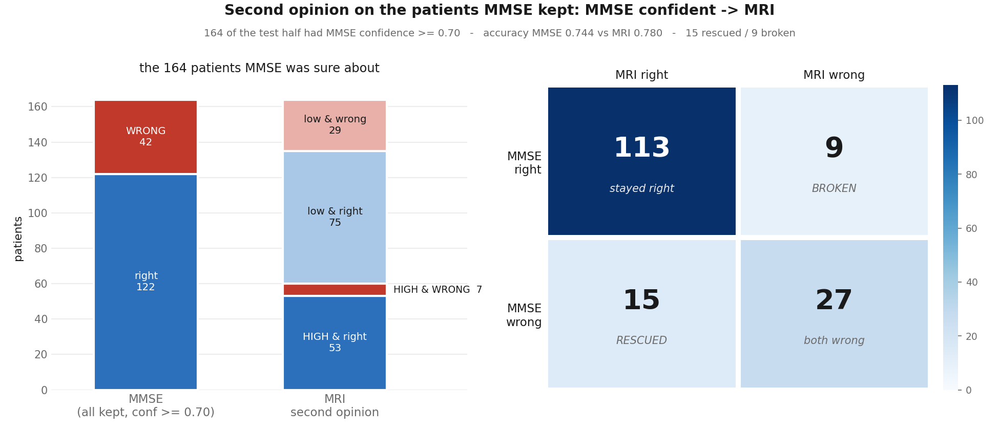
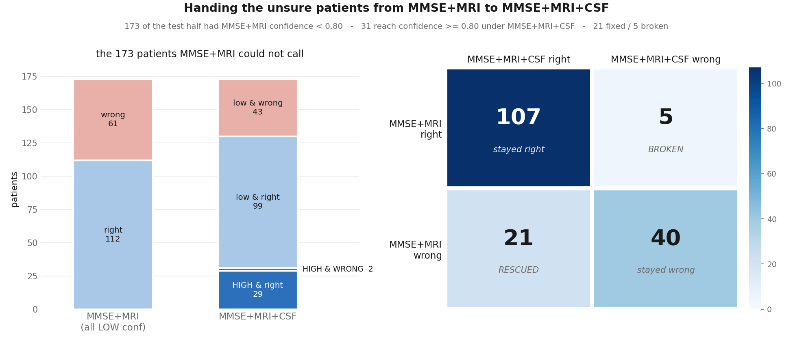

# Uncertainty Quantification for MCI-to-AD Conversion

Sparse, confidence-aware classifiers that predict conversion from mild cognitive
impairment (MCI) to Alzheimer's disease from **baseline (t=0)** ADNI measurements —
cognition (MMSE), structural MRI (FreeSurfer 7 Desikan-Killiany) and CSF biomarkers
(Roche Elecsys).

Every model is a **CLG-Lasso** (cyclic coordinate descent for logistic regression with a
Laplace prior, Genkin, Lewis & Madigan, *Technometrics* 2007), implemented from scratch in
[`clg_lasso.py`](src/adniuq/clg_lasso.py). The Laplace prior drives most coefficients to
exactly zero, so each fitted model carries its own feature selection, and each run exports
what it kept and what it eliminated.

Beyond point accuracy, every model reports a **confidence × correctness** breakdown: how
often it is confidently right, and — the number that matters clinically — how often it is
confidently wrong.

---

## Results

All models are scored on the **same 233 held-out patients** (776-patient tri-modal cohort,
36.2 % converters, majority baseline 0.6395, PR-AUC baseline 0.3605).

| Model | Features | Non-zero | λ | ROC-AUC | 95 % CI | Bal. acc | Accuracy | Cost |
|---|---|---|---|---|---|---|---|---|
| MMSE alone | 37 | 9 | 16 | 0.682 | [0.606, 0.753] | 0.584 | 0.691 | bedside |
| CSF alone | 9 | 5 | 2 | 0.772 | [0.705, 0.836] | 0.713 | 0.755 | lumbar puncture |
| MRI alone | 323 | 36 | 12 | 0.784 | [0.720, 0.850] | 0.708 | 0.743 | scan |
| MMSE + MRI | 360 | 46 | 12 | 0.797 | [0.729, 0.863] | 0.711 | 0.760 | scan |
| **MMSE + MRI + CSF** | 369 | 7 | 48 | **0.827** | [0.766, 0.881] | 0.628 | 0.717 | scan + LP |

All five are fitted by the same stage (`s04_individual_models`) on the same canonical
split: a model is simply one or more modalities, and the fusion feature blocks are
concatenated from the row-aligned per-modality tables rather than from a separate dataset
stage.

Read the confidence intervals before the point estimates: they are roughly 0.13 wide on 233
patients, so most of these models are not separated by the data. The tri-modal model is the
only one whose interval clears the MMSE model's.

Every number above is regenerated by re-running the pipeline and is written to
`outputs/*/*_results.csv` and `outputs/*/*_results.xlsx`.

### Split-resampled results (stage 09)

The table above comes from **one** 70/30 split. That single split is itself a draw: a
different partition of the same 776 patients gives a different number, and on a 233-patient
test set the difference is not small. `s09_cross_validation` re-runs each model over 20
stratified 70/30 resamples — **λ re-selected inside every training set**, preprocessing
re-fitted per split — and reports mean ± sd:

<!-- cv-summary:start -->
| Model | Splits | ROC-AUC | PR-AUC | Balanced acc | Accuracy | Sensitivity | Specificity |
|---|---|---|---|---|---|---|---|
| MMSE+MRI+CSF | 20 | 0.808 ± 0.020 | 0.661 ± 0.041 | 0.678 ± 0.036 | 0.730 ± 0.022 | 0.495 ± 0.099 | 0.862 ± 0.039 |
| CSF | 20 | 0.783 ± 0.028 | 0.627 ± 0.055 | 0.676 ± 0.039 | 0.721 ± 0.029 | 0.517 ± 0.093 | 0.836 ± 0.040 |
| MMSE+MRI | 20 | 0.758 ± 0.027 | 0.625 ± 0.045 | 0.661 ± 0.033 | 0.715 ± 0.025 | 0.468 ± 0.075 | 0.854 ± 0.034 |
| MRI | 20 | 0.747 ± 0.029 | 0.611 ± 0.041 | 0.646 ± 0.025 | 0.702 ± 0.025 | 0.443 ± 0.042 | 0.848 ± 0.034 |
| MMSE | 20 | 0.664 ± 0.031 | 0.532 ± 0.043 | 0.576 ± 0.021 | 0.669 ± 0.019 | 0.243 ± 0.047 | 0.910 ± 0.033 |
<!-- cv-summary:end -->



The ± is the **spread across splits**, not a standard error: the training sets overlap
between resamples, so it measures how sensitive a model is to which patients land in the
test set. It is narrower than a genuine out-of-sample interval and should be read alongside
the bootstrap CIs in the table above, which quantify a different uncertainty (sampling of
test patients within one split).

The λ chosen per split is also recorded (`lambda_stability` sheet). A model whose λ jumps
around between resamples is telling you the regularisation strength is weakly identified by
this much data.

### The modality handoff (stage 13)

Everything above shares one 70/30 split and asks about *fusion*. `s13_modality_handoff`
asks a narrower question on its own footing: fit **three single-modality classifiers** on a
fresh stratified **50/50** split of the same 776 patients (388 train / 388 test, seed 42),
then take the patients the cheap model was **not confident about** and look at what the next
model does with those exact patients — does it become confident, and does the answer change?

The three models on the same 388 held-out patients (majority 0.6392):

| Model | Features | Non-zero | λ | ROC-AUC | 95 % CI | Accuracy | Max confidence | % HIGH (≥0.80) |
|---|---|---|---|---|---|---|---|---|
| MMSE | 37 | 8 | 16 | 0.656 | [0.596, 0.713] | 0.668 | 0.741 | 0.0 % |
| MRI | 323 | 27 | 12 | 0.728 | [0.674, 0.778] | 0.701 | 0.962 | 27.3 % |
| CSF | 9 | 4 | 16 | 0.812 | [0.766, 0.854] | 0.732 | 0.939 | 15.7 % |

These are lower than the headline table by construction — 388 training patients instead of
543, scored on a different 388 — and are not comparable to it.

**Who is each classifier confident about?** Every one of the 776 gets a probability from all
three models (test rows from the fitted model, train rows out-of-fold), so the confident and
underconfident populations can be counted directly:

| Model | ≥0.70 confident | acc | conf. wrong | ≥0.80 confident | acc | conf. wrong |
|---|---|---|---|---|---|---|
| MMSE | 298 (38.4 %) | 0.738 | 78 | 2 (0.3 %) | 0.500 | 1 |
| MRI | 384 (49.5 %) | 0.828 | 66 | 189 (24.4 %) | 0.873 | 24 |
| CSF | 295 (38.0 %) | 0.868 | 39 | 106 (13.7 %) | 0.915 | 9 |

MMSE is the outlier: it essentially never clears 0.80, and where it is confident at 0.70 it
is right 74 % of the time against MRI's 83 % and CSF's 87 %. That is the whole premise of
the handoff — and the reason the source gate is 0.70 rather than 0.80.

**The handoff, MMSE → MRI.** MMSE's confidence never exceeds 0.741, so the source gate is
0.70 rather than 0.80 (at 0.80 it hands off all 388 and the hop stops being a selection;
every other gate is tabulated in the `_sweep` sheet). At 0.70,
MMSE keeps 164 patients and hands 224 to MRI — and those 224 are the harder half, 43.8 %
converters against 36.1 % overall.



- **Does MRI become confident about them?** 46 of the 224 (20.5 %) reach confidence ≥ 0.80.
  Of those 46, **34 are right and 12 are confidently wrong** — so the fifth of the cohort MRI
  is willing to call, it calls at 74 % accuracy. The other 178 stay below the gate.
- **Does the answer change?** Accuracy on these 224 goes 0.612 (MMSE) → 0.643 (MRI). MRI
  **fixes 37** patients MMSE got wrong and **breaks 30** it got right — a net gain of 7 out
  of 224. 157 patients are unchanged.

The churn is the point: a 3-point accuracy gain is 67 patients changing sides, not 7 patients
improving. The workbook carries every one of them by RID.

**The handoff, MRI → CSF.** The 178 MRI was still unsure about go on to CSF. MRI can reach
the 0.80 band, so this hop gates at 0.80 rather than 0.70 — which means all 178 pass through
by construction, since they are exactly the patients MRI left under that band.



- **Does CSF become confident about them?** 24 of 178 (13.5 %) — **21 right, 3 confidently
  wrong**. 154 stay unsure. Mean confidence *falls* by 0.008: CSF is not systematically more
  certain about this group, it is certain about a different, smaller slice of it.
- **Does the answer change?** 0.618 (MRI) → 0.652 (CSF) on these 178. **32 fixed, 26 broken**,
  net +6 — the same shape as hop 1, and again 58 patients change sides to move 6.

End to end, of the 388 held-out patients: MMSE confidently answers 164, MRI adds 46, CSF adds
24, and **154 are left that no single modality can call** — 40 % of the cohort. On those 154
every model scores *below* the 0.639 majority baseline — MMSE 0.578, MRI 0.584, CSF 0.617 —
so on this group the confidence gate is not merely cautious, it is correctly identifying
patients on whom all three classifiers are worse than guessing the majority class.

| Hop | Incoming | Gate | Handed on | Became confident | Right / wrong | Fixed | Broken | Net |
|---|---|---|---|---|---|---|---|---|
| MMSE → MRI | 388 | 0.70 | 224 | 46 (20.5 %) | 34 / 12 | 37 | 30 | +7 |
| MRI → CSF | 178 | 0.80 | 178 | 24 (13.5 %) | 21 / 3 | 32 | 26 | +6 |

The consistent finding across both hops is that a new modality buys **confidence on a small
minority** and a **net accuracy gain far smaller than the churn it causes**. Roughly one
patient is broken for every 1.2 fixed.

### Auditing the other half: the patients MMSE *kept* (stage 15)

Stage 13 only ever routes the patients the source model could not call. The 164 it *could*
call are kept and never get a second opinion, so nothing in stage 13 says whether that
confidence was earned. `s15_confident_audit` closes that gap: it takes the complement — the
164 test patients with MMSE confidence ≥ 0.70 — and runs them through the **already-trained**
MRI model. Nothing is re-fitted; same 50/50 split, same seed, same λ, so the audited set and
stage 13's hop-1 set partition the same 388 held-out patients exactly.



MMSE is right on **122 of the 164** it kept (0.744) and **confidently wrong on 42**. Handing
those same patients to MRI:

| | MRI right | MRI wrong | |
|---|---|---|---|
| **MMSE right** | 113 stayed right | **9 broken** | 122 |
| **MMSE wrong** | **15 rescued** | 27 both wrong | 42 |
| | 128 | 36 | 164 |

**15 rescued against 9 broken, net +6** — accuracy 0.744 → 0.780. The two models disagree on
only 24 of 164, so the confident set is genuinely the easy set: MMSE and MRI agree about 85 %
of it, and the disagreements break 5-to-3 in MRI's favour rather than either model dominating.

The result that matters for routing is *where* those disagreements sit. Split the 164 by
whether MRI is itself confident:

| MRI band | n | MMSE acc | MRI acc | Rescued | Broken | Net |
|---|---|---|---|---|---|---|
| HIGH (≥ 0.80) | 60 | 0.883 | 0.883 | 1 | 1 | **0** |
| low (< 0.80) | 104 | 0.664 | 0.721 | 14 | 8 | **+6** |

**Every one of the net gains comes from patients MRI is not confident about.** On the 60 it
*is* confident about, the two models score identically (0.883) and the trade is 1-for-1. So
the obvious safety rule — only override a confident MMSE call when MRI is confident too —
recovers nothing at all:

| Policy on the 164 kept patients | Correct | Accuracy | vs. keeping MMSE |
|---|---|---|---|
| Keep MMSE (what stage 13 does) | 122 | 0.744 | — |
| Always defer to MRI | 128 | 0.780 | **+6** |
| Defer to MRI only when MRI is confident | 122 | 0.744 | **0** |

Two things follow. First, MMSE's 0.70 gate is doing real work: the patients it keeps are
answered at 0.744 by MMSE and 0.780 by MRI, both far above the 0.612/0.643 the same pair
manage on the 224 it hands off. The gate is separating easy from hard, not confident from
unconfident at random. Second, the gate is *not* free — 42 confidently wrong calls stand
unexamined in stage 13, and MRI would overturn 15 of them. Whether that is worth 9 broken
calls is a cost question the accuracy number alone does not answer.

The gain also shrinks monotonically as the gate rises, which is what a well-behaved gate
should do — the patients kept at a higher bar are the ones a second opinion has least to add
to:

| MMSE gate | Kept | MMSE acc | MRI acc | Rescued | Broken | Net |
|---|---|---|---|---|---|---|
| 0.55 | 340 | 0.685 | 0.718 | 42 | 31 | +11 |
| 0.60 | 282 | 0.716 | 0.752 | 30 | 20 | +10 |
| 0.65 | 222 | 0.734 | 0.775 | 20 | 11 | +9 |
| **0.70** | **164** | **0.744** | **0.781** | **15** | **9** | **+6** |

The direction replicates on the training half scored out-of-fold (134 kept, 11 rescued /
3 broken) and over all 776 patients (298 kept, 26 / 12), so the sign of the effect is not an
artefact of the one 388-patient test half — though the broken count is the less stable of the
two.

**The same audit at hop 2.** `--upstream` restricts the pool to the patients the earlier
models actually handed on, so the audited set is the one the source model keeps *mid-chain*
rather than over the whole test half — for hop 2 that is the 46 patients MRI became
confident about out of the 224 MMSE passed it (34 right, 12 confidently wrong):

```
python run.py s15_confident_audit --source mri --target csf --upstream mmse
```

| | CSF right | CSF wrong | |
|---|---|---|---|
| **MRI right** | 32 stayed right | **2 broken** | 34 |
| **MRI wrong** | **4 rescued** | 8 both wrong | 12 |

4 rescued against 2 broken, net +2 (0.739 → 0.783), on 6 disagreements out of 46. And the
band split repeats exactly: of the 12 patients CSF is confident about, it rescues 0 and
breaks 0 — MRI and CSF both score 0.917 there — so all of the movement is again in CSF's
low-confidence region, and the confident-override policy again recovers none of it.

**This one should not be read as a gain.** 46 patients and a 4-vs-2 margin is a handful, and
unlike hop 1 the sign does not survive the other splits: out-of-fold on the training half it
is 0 rescued / 7 broken, and over all 776 patients 4 / 9. Hop 1's +6 replicates in direction;
hop 2's +2 does not.

Running without `--upstream` audits the source model's confident set over the whole 388
instead — a different and much larger population (for MRI, 106 patients rather than 46, since
it includes the ones MMSE already answered at hop 1), which does not correspond to anything
the chain actually does.

### Accumulating instead of swapping (stage 14)

Stage 13 hands each hop to a model that has *replaced* the previous modality — MRI never
sees the MMSE scores. `s14_fusion_handoff` runs the identical machinery on the identical
50/50 split, but each step *adds* a modality instead:
**MMSE → MMSE+MRI → MMSE+MRI+CSF**.

| Model | Features | Non-zero | λ | ROC-AUC | 95 % CI | Accuracy | Max confidence | % HIGH |
|---|---|---|---|---|---|---|---|---|
| MMSE | 37 | 8 | 16 | 0.656 | [0.596, 0.713] | 0.668 | 0.741 | 0.0 % |
| MMSE+MRI | 360 | 32 | 12 | 0.737 | [0.683, 0.788] | 0.717 | 0.936 | 31.2 % |
| MMSE+MRI+CSF | 369 | 29 | 12 | 0.804 | [0.757, 0.847] | 0.760 | 0.976 | 36.3 % |



| Hop | Incoming | Gate | Handed on | Became confident | Right / wrong | Fixed | Broken | Net |
|---|---|---|---|---|---|---|---|---|
| MMSE → MMSE+MRI | 388 | 0.70 | 224 | 51 (22.8 %) | 37 / 14 | 34 | 22 | **+12** |
| MMSE+MRI → MMSE+MRI+CSF | 173 | 0.80 | 173 | 31 (17.9 %) | 29 / 2 | 21 | 5 | **+16** |

**Accumulating is strictly better than swapping**, and the second hop is where the two
designs separate hardest. On its 173 patients the fusion model fixes 21 and breaks only
**5** — accuracy 0.647 → 0.740 — where stage 13's CSF-only model fixed 32 but broke 26 on a
comparable group, for a third of the net gain. Two reasons, both visible in the workbooks:
the fusion model cannot lose what MMSE and MRI already knew, and its λ search runs over 369
features rather than 9, so it can keep a CSF signal *and* the imaging evidence that
contradicts it. Of the 31 patients it becomes confident about, only 2 are confidently wrong.

End to end: MMSE answers 164, +MRI adds 51, +CSF adds 31, leaving **142 of 388 (36.6 %)
unclaimed** against 154 for the single-modality chain. The tri-modal model does reach 0.697
on those 142 — above the 0.639 majority baseline, where every model in stage 13 fell below
it. So accumulation helps the hardest patients too; it just cannot make the model confident
about them.

---

## Methodology guarantees

These are properties of the pipeline, not of any single script:

- **No test leakage in preprocessing.** Median imputation and standardisation are fitted on
  training rows only, re-fitted inside every cross-validation fold.
- **λ is selected on training rows only**, by stratified 5-fold CV maximising ROC-AUC. The
  test set is touched once, at the end.
- **One canonical split.** The stratified 70/30 split (seed 42) is fixed when the MMSE
  dataset is built and *read by RID* by every downstream dataset — never recomputed. All
  models are therefore comparable on identical held-out patients.
- **One cohort.** Stage 02 intersects the three modalities on *values*, not on rows, so a
  patient counts only when the measurement actually exists.
- **Fusion is a feature-block concatenation, not a separate dataset.** `MMSE+MRI` and
  `MMSE+MRI+CSF` are assembled inside the modelling stage from the row-aligned per-modality
  tables, with the alignment on RID and label asserted at load time — so a fusion model is
  fitted on exactly the patients its constituent single-modality models were.
- **Confidence on training rows is out-of-fold.** Wherever a patient the model was fitted on
  needs a probability (confidence bands, the handoff chains), it comes from an out-of-fold
  prediction — in-sample confidence is optimistic. Test rows carry the fitted model's
  probability, as in deployment, and the source of each number is recorded in the data.
- **Coverage floor.** Columns present for fewer than 50 % of patients are dropped (a column
  that is 98 % imputed is a constant wearing a feature's name). What was dropped is printed
  and written to the workbooks.
- **The cohort is 36.2 % converters**, so predicting "stable" for everyone scores 0.638.
  ROC-AUC, PR-AUC and balanced accuracy carry the comparison; accuracy alone cannot.

---

## Project structure

```
.
├── run.py                          # zero-install entry point
├── pyproject.toml                  # package metadata, `adniuq` console script
├── requirements.txt
├── src/adniuq/
│   ├── cli.py                      # stage dispatcher (`adniuq <stage>`, `adniuq all`)
│   ├── paths.py                    # every input/output path, absolute, in one place
│   ├── io.py                       # CSV / Excel / markdown writers, upsert helper
│   ├── clg_lasso.py                # CLG-Lasso solver (Laplace prior, trust-region Newton)
│   ├── modeling.py                 # preprocessing, λ search, metrics, bootstrap, report
│   ├── features.py                 # feature vocabulary, metadata rules, coverage filter
│   ├── selection.py                # non-zero vs zeroed feature workbooks
│   └── stages/
│       ├── s01_baseline_data.py        # raw ADNI  -> per-modality t=0 tables + audit
│       ├── s02_trimodal_baseline.py    # restrict to patients with all three modalities
│       ├── s03_conversion_labels.py    # DXSUM trajectory -> converter / stable
│       ├── s03_mmse_conversion.py      # MMSE dataset + the canonical train/test split
│       ├── s03_modality_conversion.py  # MRI / CSF datasets on that same split
│       ├── s04_individual_models.py    # all five models: 3 modalities + 2 fusions
│       ├── s04_feature_selection.py    # what each model kept, what it zeroed
│       ├── s09_cross_validation.py     # resampled splits -> mean +- sd per model
│       ├── s09_readme_table.py         # writes that summary into this README
│       ├── s11_confidence_bands.py     # every patient's band, both fusion models
│       ├── s12_boundary_distance.py    # signed log-odds / geometric distance per patient
│       ├── s13_modality_handoff.py     # 3 single-modality models on a 50/50 split, handoff
│       ├── s14_fusion_handoff.py       # same, but each hop adds a modality to the last
│       └── s15_confident_audit.py      # the complement: what MRI does to the ones MMSE kept
├── outputs/                        # everything the pipeline produces, one dir per stage
│   ├── 01_baseline_data/           # {mmse,mri,csf}_baseline.csv, audit_report.md
│   ├── 02_trimodal_baseline/       # aligned tri-modal tables, cohort RIDs
│   ├── 03_conversion_dataset/      # conversion_labels.csv, {mod}_conversion.csv/.xlsx
│   ├── 04_individual_models/       # all five models: results, heatmaps, feature
│   │                               #   selection, fusion confidence bands
│   ├── 09_cross_validation/        # per-split results, mean +- sd summary, AUC spread
│   ├── 12_boundary_distance/       # per-patient distance to each fusion boundary
│   ├── 13_modality_handoff/        # 50/50 split, MMSE -> MRI -> CSF handoff
│   │   └── confident_audit/       # stage 15: second opinion on the patients MMSE kept
│   └── 14_fusion_handoff/          # 50/50 split, MMSE -> +MRI -> +CSF handoff
└── data/raw/                       # ADNI source tables (not committed — see below)
```

### Paths

No script uses a relative path or a `..` hop. [`paths.py`](src/adniuq/paths.py) resolves the
project root from the package location and exposes every input and output as an absolute
`Path`; stages import the constant they need. Both roots are overridable by environment
variable, so the same code runs unchanged from any working directory, in CI, or in a
container:

| Variable | Default | Meaning |
|---|---|---|
| `ADNIUQ_DATA_DIR` | `<repo>/data/raw` | ADNI source tables |
| `ADNIUQ_OUTPUT_DIR` | `<repo>/outputs` | generated datasets, models, figures |

---

## Data

The ADNI source tables are **licence-restricted and are not distributed with this
repository** (`data/` is git-ignored). Apply through [adni.loni.usc.edu](https://adni.loni.usc.edu),
then place the downloads as:

```
data/raw/
├── *DXSUM*.csv                              # diagnostic summary (defines t=0 and the label)
├── Cognitive/All_Subjects_MMSE_*.csv        # MMSE item-level scores
├── MRI/All_Subjects_UCSFFSX7_*.csv          # FreeSurfer 7 cross-sectional
└── CSF/UPENNBIOMK_ROCHE_ELECSYS_*.csv       # Roche Elecsys CSF analytes
```

Files are matched by glob, so version suffixes in the ADNI filenames do not matter.

Stages 02 onwards read only from `outputs/`, so the committed derived tables let you
reproduce and extend the modelling work without the raw downloads.

---

## Installation

```bash
git clone <your-fork-url>
cd uncertainty-quantification
python -m pip install -r requirements.txt
```

Python 3.10+. Optionally install the package itself for the `adniuq` command:

```bash
python -m pip install -e .
```

---

## Usage

Without installing, from the repository root:

```bash
python run.py list                                      # show the stages
python run.py all                                       # run the whole pipeline in order
python run.py s04_individual_models --model csf         # run one model
python run.py s04_individual_models --model fusion      # just the two fusion models
```

Installed, `adniuq` is equivalent:

```bash
adniuq all
adniuq s04_individual_models --model mmse_mri_csf
```

Every stage takes `--help`. The options that matter most:

| Option | Stages | Default | Effect |
|---|---|---|---|
| `--min-coverage` | all modelling stages | `0.5` | drop columns below this coverage |
| `--hi` | modelling stages | `0.80` | confidence band for the heatmap |
| `--folds`, `--cv-seed` | modelling stages | `5`, `0` | λ-search cross-validation |
| `--boot`, `--boot-seed` | modelling stages | `2000`, `0` | bootstrap CI over test patients |
| `--model` | `s04_individual_models` | `all` | one of `mmse`, `mri`, `csf`, `mmse_mri`, `mmse_mri_csf`, or the groups `single` / `fusion` / `all`. `--modality` is accepted as an alias |
| `--max-gap-months` | dataset stages | none | drop records far from t=0 |
| `--test-size`, `--seed` | `s03_mmse_conversion` | `0.30`, `42` | the canonical split |
| `--repeats`, `--scheme` | `s09_cross_validation` | `20`, `shuffle` | how the split is resampled |
| `--models`, `--inner-folds` | `s09_cross_validation` | all five, `5` | which models, λ-search folds |
| `--chain` | `s13`/`s14` handoff | `mmse mri csf` / `mmse mmse_mri mmse_mri_csf` | handoff order; each hop is fed the previous model's unsure patients. Any of `mmse`, `mri`, `csf`, `mmse_mri`, `mmse_mri_csf` |
| `--hi-source` | `s13`/`s14` handoff | per source model | gate the source must clear to keep a patient — `--hi`, except MMSE at `0.70`; one value or one per hop |
| `--test-size`, `--seed` | `s13`/`s14` handoff | `0.50`, `42` | their own split, independent of the canonical one |

Stage order matters — each stage validates its inputs and exits with the upstream stage to
run if something is missing.

**Runtime.** Stages 01–04 take a few minutes end to end. Stage 09 dominates: it fits every
model 20 times with a full λ search inside each training set, which is roughly 40 minutes on
a laptop. Cut it down with `--repeats 5` or restrict it with
`--models MMSE CSF` while iterating.

---

## Outputs

Each modelling stage writes:

- `confidence_matrix_*.png` — the confidence × correctness 2×2, annotated with AUC and
  accuracy conditioned on the confidence band.
- `*_results.xlsx` — per-patient test predictions, the confidence matrix, the full metric
  set with bootstrap CIs, fitted weights, and the λ cross-validation curve.
- `*_feature_selection.xlsx` — surviving features ranked by weight, eliminated features,
  and selection rates by modality and by anatomical/cognitive group.
- `*_results.csv` — one summary row per model, upserted so re-runs replace rather than
  duplicate.

Stage 04 writes one set of these per model, keyed by `mmse`, `mri`, `csf`, `mmse_mri` and
`mmse_mri_csf`, all into `outputs/04_individual_models/`. Stage 11 adds
`{model}_confidence_bands.xlsx` for the two fusion models — every patient's band, the band
composition by split, and the confidence × correctness matrix.

Stage 09 additionally writes `cv_repeats.csv` (one row per model per split),
`cv_summary.csv` (mean / sd / min / max per metric), `cross_validation.xlsx` and
`cv_auc_distribution.png`.

Stage 13 writes `modality_handoff.xlsx`, whose sheets answer the handoff question directly:

| Sheet | What it holds |
|---|---|
| `all_patients` | **all 776 patients under all three classifiers before any handoff** — each model's probability, confidence, `confident` / `underconfident` status at both thresholds, prediction and correctness, plus `n_models_confident`, `models_confident` and `all_models_agree` |
| `confidence_counts` | how many patients each model is confident about, by split, at every gate from 0.55 to 0.90 — with accuracy inside each band and the confidently-wrong count |
| `test_predictions` | the 388 held-out patients only, all three models side by side |
| `model_summary` | the three models' metrics with bootstrap CIs |
| `hop1_patients` | **one row per handed-off patient** — both models' probability, confidence, prediction and correctness, plus `became_confident`, `confidence_gain`, `correctness_move` (`right -> wrong` etc.), `fixed`, `broken` |
| `hop1_conf_move` | source band × target band over everyone the source saw |
| `hop1_correct_move` | source right/wrong × target right/wrong on the handed-off set |
| `hop1_sweep` | the same hop at source gates 0.55 → 0.90, so the gate choice is visible rather than assumed |
| `hop2_*` | the same four sheets for the second hop, whose model sees only the patients hop 1's target was *also* unsure about |
| `hop_summary` | one row per hop, naming its source and target |
| `run_config` | split, seeds, λ per model, max confidence per model, and the caveats |

Sheets are numbered rather than named after their models because Excel caps sheet names at
31 characters; `hop_summary` carries the source → target mapping. The figures keep the long
descriptive filenames. Stage 14's workbook, `14_fusion_handoff/fusion_handoff.xlsx`, has
exactly the same layout.

In `all_patients`, the 388 test rows carry the fitted model's probability (as in
deployment) and the 388 train rows carry an out-of-fold probability — a model's confidence
about a patient it was fitted on is optimistic. The `_conf_source` column records which,
and bands should be compared within a split, not across. The handoff itself uses the test
half only. `all_patients` and `test_predictions` are also written as flat CSVs.

---

## Caveats carried deliberately

- **MMSE columns are exactly nested** — `MMSCORE` is the sum of the 30 items and each domain
  is the sum of its own items. Predictions are unaffected, but MMSE weights are not effect
  sizes: the lasso keeps whichever collinear copy it reaches first.
- **MRI field strength tracks study era** (1.5 T = ADNI-1, 3 T = ADNI-GO/2/3), and the eras
  differ in conversion rate. It is carried as provenance, never as a feature, so it can be
  controlled for downstream.
- **Four of the nine CSF columns are assay censoring flags** — they describe how the Elecsys
  assay behaved, not the patient. Two survive the lasso. They are kept for consistency
  across models; excluding them is a one-line change in `s03_modality_conversion.py`.
- **Some "stable" patients have little or no follow-up.** The label build reports the
  follow-up distribution rather than silently treating a patient seen once as a confirmed
  non-converter; `--min-followup-months` filters them if you want that.

---

## Reference

Genkin, A., Lewis, D. D., & Madigan, D. (2007). *Large-scale Bayesian logistic regression
for text categorization.* Technometrics, 49(3), 291–304.

Data used in this project were obtained from the Alzheimer's Disease Neuroimaging Initiative
(ADNI) database. ADNI investigators contributed to the design and implementation of ADNI
and provided data but did not participate in the analysis or writing of this work.
